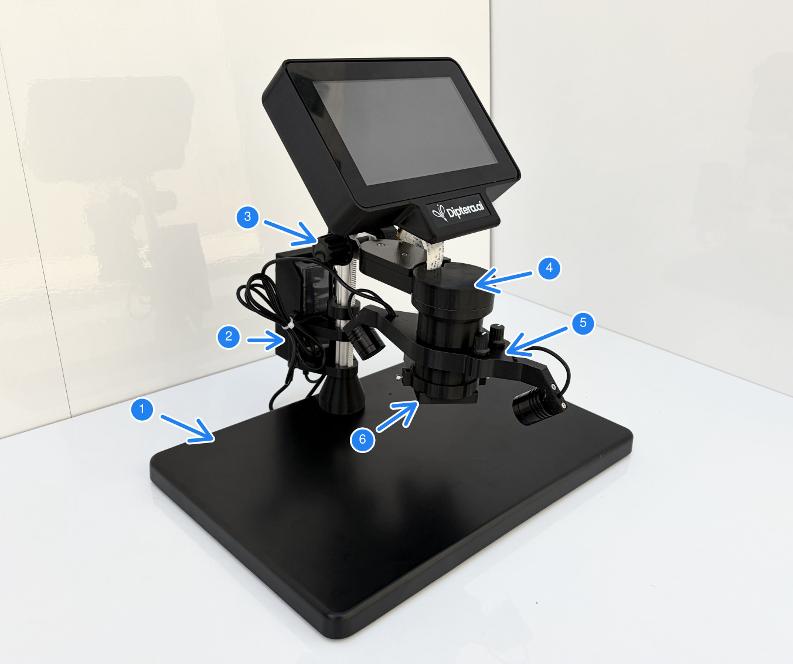
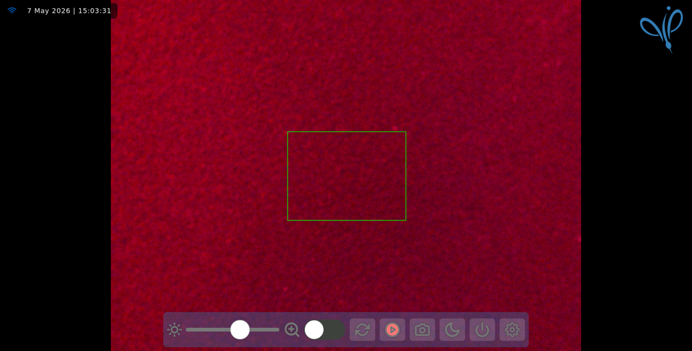

# FluoreScope &emsp;[v 1.0] 

The FluoreScope, by [Diptera.ai](https://diptera.ai "Diptera.ai's Homepage"), is a specialized imaging system designed 
for rapid identification and screening of genetically modified mosquitoes. By utilizing integrated emission filtering and dual-LED excitation, the system allows for high-contrast viewing of fluorescent markers, e.g. DsRed, in live specimens. 

This product is currently under development.

## Overview

1. Base-plate
2. Power supply unit
3. Height-adjustment knobs screws
4. Camera and objective, with an integrated emission filter 
5. Excitation illumination module
6. Additional emission filter slide

### System Setup

To ensure the best signal-to-noise ratio, please follow these steps:
- Placement: Position the FluoreScope on a stable, leveled, vibration-free surface. 
- Environment: Work in a dark room.
- Sample Loading: The attached black PLA (3D-printed) dishes, when wet with a small amount of water, offer a reflection-free background. 
- Powering excitation source: Use the knobs to control the power of the LEDs individually. 
- Focusing: Use the coarse and fine height-adjustment knobs (screw on the back should be tight) to get the camera to the right height.
- Power: When finished working, power off the FluoreScope.

### Software

The FloureScope software allows for easy visualisation and image/video capturing.

> [!Tip]
> While the monitor of the FluoreScope can be controlled by touch, it is advised to work with a mouse. 

- Wifi: With internet access, the FloureScope periodically receives software updates and sends system reports to Diptera.ai. When disconnected, the FloureScope acts as a network access point, so you can connect to it and type in your wifi credentials:
    1. Open the WiFi settings on your phone or computer.
    2. Connect to the FloureScope network called "RPI-SETUP" and enter the password "setup1234"
    3. After connecting to the setup network, open a web browser and go to: http://10.42.0.1:80
    4. A WiFi setup page will open. Select your normal WiFi network from the list, enter your password and press “Connect”.
    5. Wait a few seconds while the FloureScope connects to the network.
    6. Once connected, the FloureScope's setup wifi network ("RPI-SETUP") will automatically disappear.

       
- From left to right, the buttons on the bottom of the screen:
    - Brightness bar
    - Zoom in toggle switch 
      - Ths is digital zoom, to the area marked with a green rectangle
      - Zoom magnification can be set in settings
    - Revert settings
    - Video record * 
    - Image capture *
     
    \* (automatically saved on an external device connected via usb)
    - Turn screen off
    - Shutdown
    - Settings

  

